# 包容性设计
> Inclusive Design

---

## 从一些负面典型说起

----

#### OPPO 手机开启无障碍功能的验证码

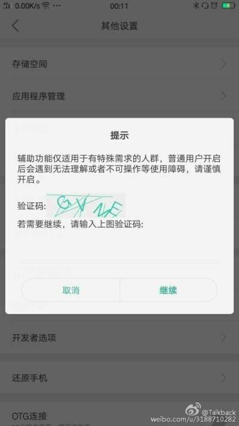

----

#### Ant Design 的圣诞节彩蛋

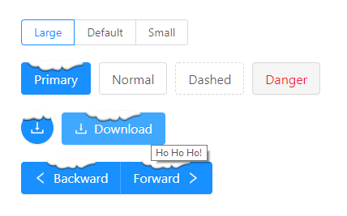

---

## 什么是包容性设计？

----

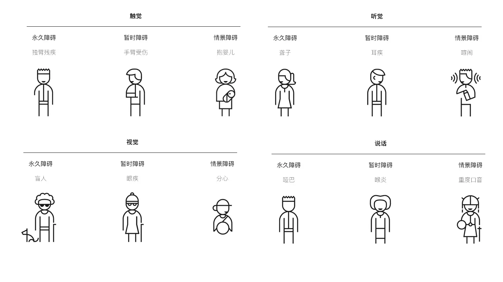

----

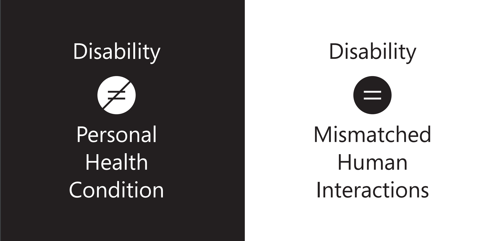

Note: 包容性设计不仅只有关于残疾。它面向的是各种可能会有使用障碍的人群(包括但不限于性别、年龄、种族等)，以及临时性、情境性导致普通人失去使用能力的场景。

----

无障碍设计 vs 包容性设计 vs 通用性设计

Note: Inclusive design was not meant to address a specific group of users, and to design special accessibility features. It is meant to see a different perspective from a unique user group, and gather new insights to innovate for the mainstream product.
包容性设计并不等同于专门为能力障碍群体所做的设计。我们并不是要做“人人都可以使用的设计”，而是要去做“产品的使用能力要求与终端用户的实际能力相匹配的设计。”英国工程院院士、剑桥大学Clarkson教授等人认为包容性设计的产品应当仅仅排除“需要排除”的用户（但前提是设计师必须了解谁会被排除），并不是要我们站在世界中心盲目的呼唤爱。

---

## 包容性设计 × 商业

----

#### 开源 · 长尾人群带来的用户体量

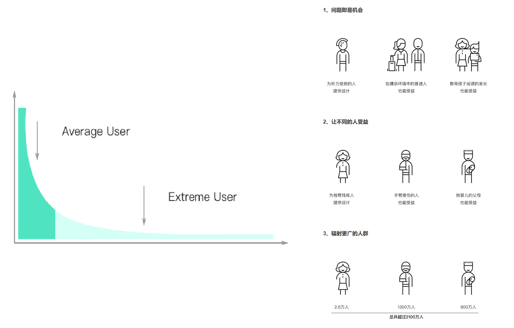

----

#### 开源 · 老龄化趋势带来的市场机会

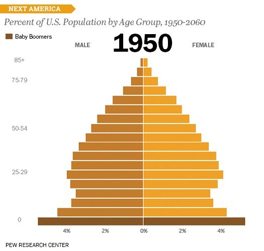

Note: 在中国，到2050年前后60岁及以上老年人口数将达到4.87亿，约占总人口的三分之一，老年人口数量和占总人口比例双双达到峰值。

----

#### 开源 · 人文关怀带来的品牌效益

----

#### 节流 · 心中长存包容性意识

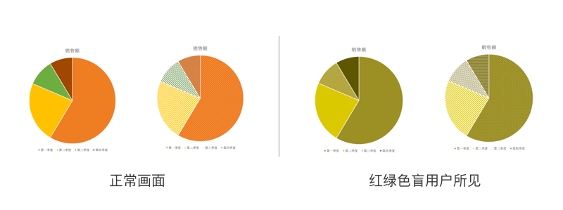

----

#### 节流 · 遵从成熟的规范和系统

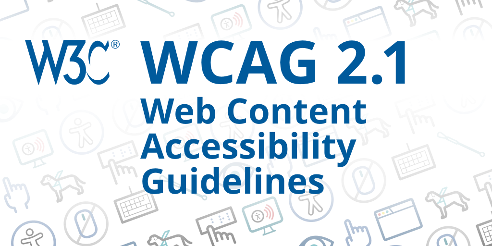

---

## 包容性设计 × 科技

----

#### 新场景的挑战 · 触屏交互

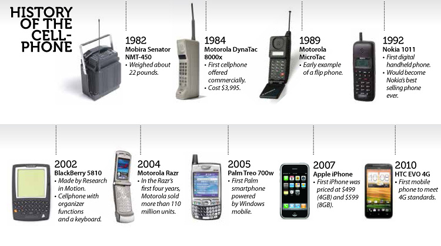

----

#### 新场景的挑战 · 无人零售

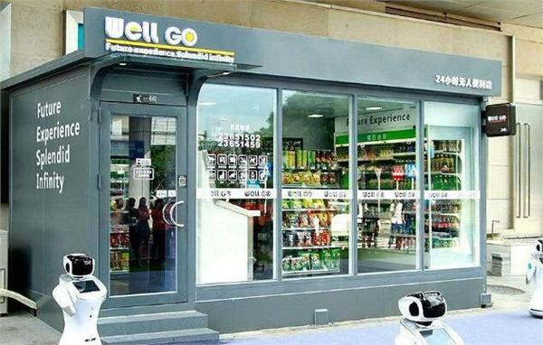

----

#### 新科技的可能 · 语音交互

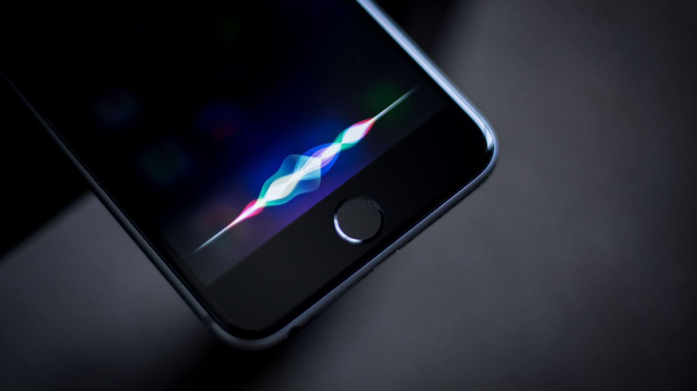

----

#### 新科技的可能 · 智能识图

----

#### 新科技的可能 · 3D 打印

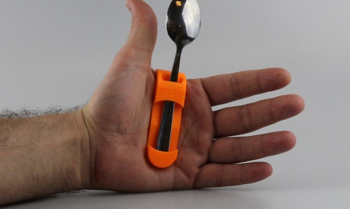

---

## 谢谢！
